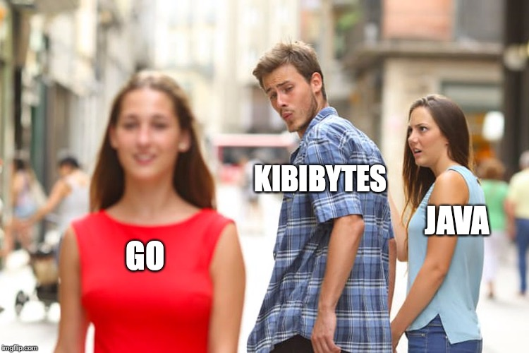
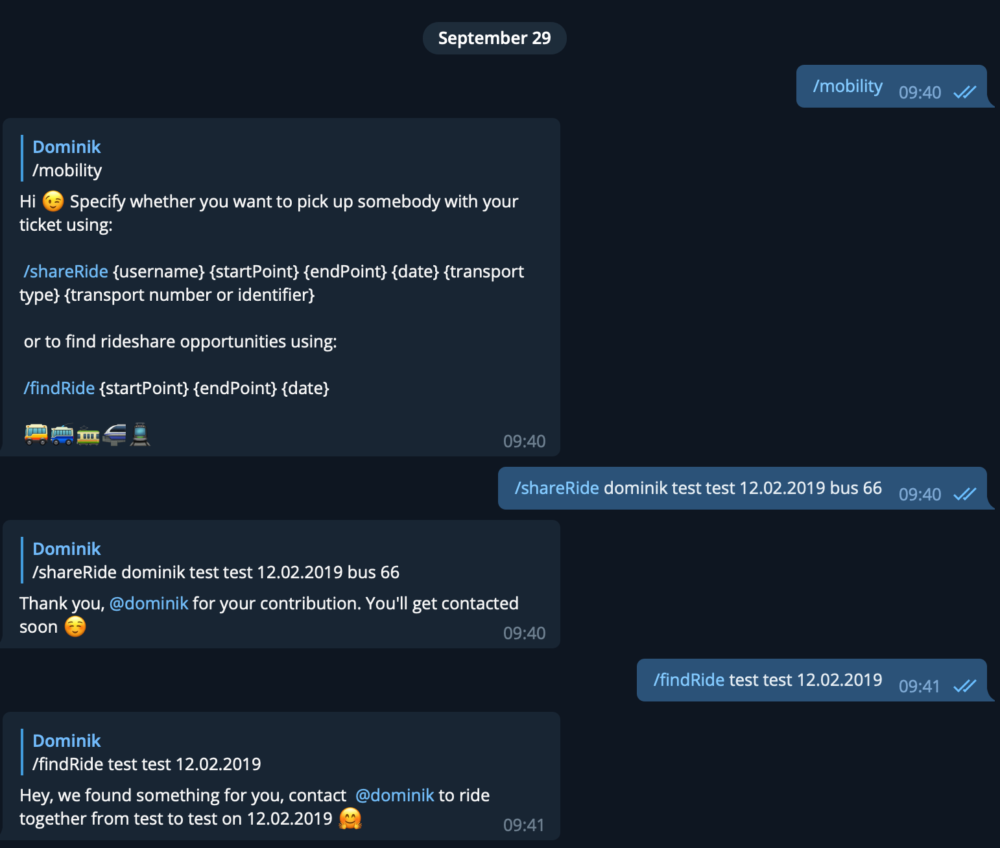

## Description 
A Telegram Chatbot that tries to help with everyday tasks. 

## Built with
* Go - main language
* SQLite - database for persisting conversation state
* Java - we made a full API to help our bot with some stuff (https://github.com/AleksandraVn/chatBot_api)
* Goland - IDE

Meme

## What benefit will your work bring in smart city context?
* improves/reduces traffic/ways
* helps to keep you busy while you wait for your train (#DBakel)
* gives weather forecast
* informs the user about public police information
* Reminds you that it's time to go home
* Find other people on the same way like you!
* Find Recharge Points
* Ridesharing

## What were challenges you encountered and Lessons Learned?
We just started with Go and needed to learn everything from scratch.
It was our first Telegram Bot. A lot of ideas needed to be put in, ranked 
by fun and how important they are (to us). The way to interact with the 
database was a bit tricky without previous experience.

## About your team
Alex wanted Java but nobody cared. So we used Go and everyone was happy (except Alex).
Just kidding. We had lots of fun learning new stuff and exploring the possibilities of Go.
4/5 people in the group are students and one is a trainee in the 3rd year. 
We had basic knowledge of Java, C, C++ and C# were learned in the university but the focus lays on Java.  
The trainee works in a company in the area of Web/App-Development and uses PHP/JS/HTML/CSS/C# most times.

## Members
https://github.com/T1m6
https://github.com/flofeld
https://github.com/fridtjof
https://github.com/AleksandraVn
https://github.com/dominikfladung

## What's next for your project?
We would have liked to implement a system where it wouldn't be necessary to use commands.
A system to filter the input as a form of interaction between the bot and the user, which lets the user
think this bot works like a AI. (of course it would look like a stupid bread in comparison to Google AIs)
We want to add more helpful features in the future.

## How does it look?
It looks like Telegram und works like Telegram. You can test it out if you like. (and if the server is running...)

Intro

Mobility

## Anything to add?
We would like to mention the immense help Club Mate and the Beer provided to keep us motivated
and fit. A big thanks to all the people who helped to keep the stock filled.
